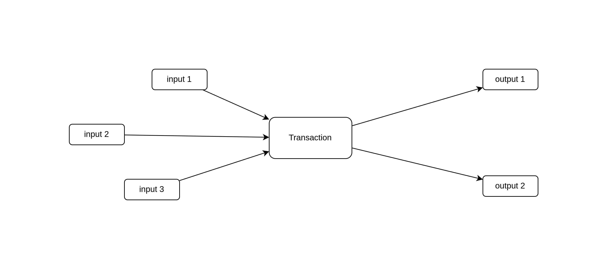
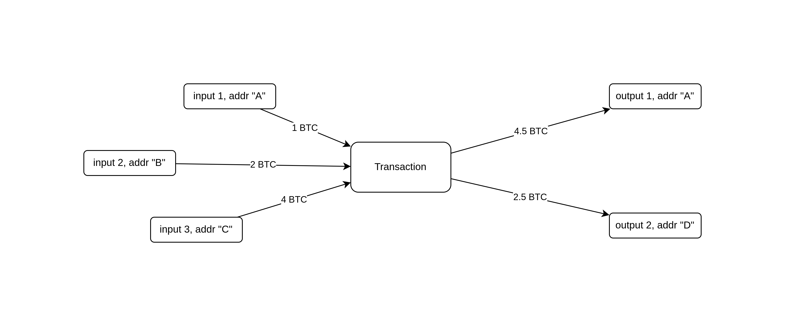
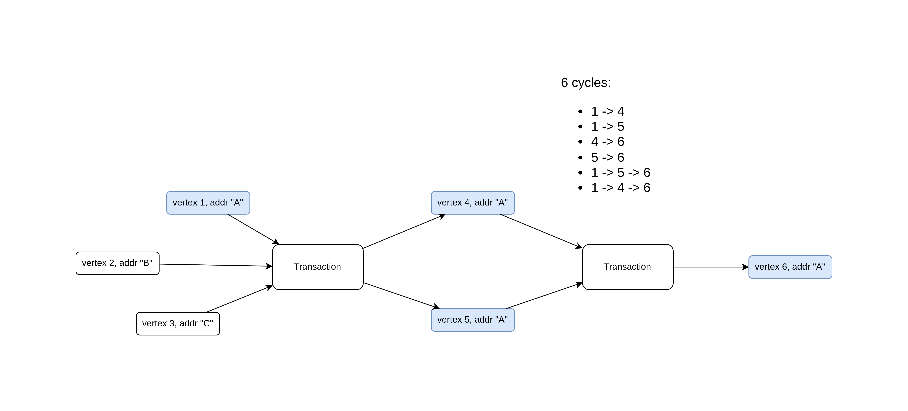
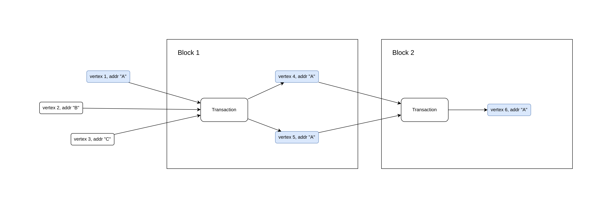

# Task Overview

Bitcoin blockchain is a [Directed Acyclic Graph (DAG)](https://coinmarketcap.com/alexandria/glossary/directed-acyclic-graph-dag) data structure.

A transaction has a set of inputs and a set of outputs (the vertices of the DAG).

All vertices of the graph are uniquely identified as "{transactionId}:{outputIndex}".

Also, all vertices have an address. All outputs are unique, but addresses can repeat.

The Bitcoin blockchain is a set of transaction batched into blocks.

We are interested in "address cycles".

Address cycle is a path in the graph from one vertex to the other with the same address. 
For example, the figure above has 1 cycle (from 'input 1, addr A' to 'output 1, addr A').
Here is another example:

Length of the cycle is the number of transaction required to close the cycle. In the figure above
there are 4 cycles with length 1 and 2 cycles with length 2.

The transactions are batched into blocks.

This is the end of introduction, you can now proceed to [the task](TASK.md)!
